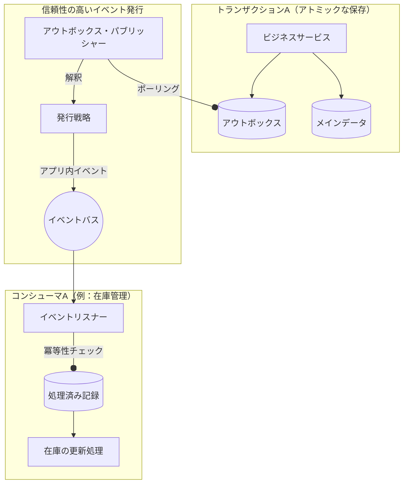

# はじめに

システムを構築していると、「メインのデータをDBに保存する」のと同時に「他ドメインへの通知」や「外部APIの呼び出し」を行いたい場面がよくあります。

しかし、単純にメソッド呼び出しや `@EventListener` を使うだけでは、以下のリスクがつきまといます。

*   **不整合** : 本データの保存は成功したが、通知先（在庫更新など）でエラーが起き、一部のデータだけが更新されない。
*   **消失** : 通知の直前にアプリケーションがクラッシュし、イベントが失われる。

これらの「二重書き込み」問題を解決し、堅牢なドメイン間連携を実現する手法が **Transactional Outbox パターン** です。本記事では、このパターンを Spring Boot のアプリ内イベントと組み合わせて実装する方法を解説します。

---

## 1. なぜこのパターンを使うのか

### 1.1 解決する問題
通常の同期的なイベント処理では、「DBへの保存」と「イベントの発行」をアトミック（不可分：一連の処理が全て成功するか、全て失敗するかのどちらかであること）に行うことが困難です。DBはコミットされたが通知に失敗した、という不整合な状態を防ぐ必要があります。

### 1.2 適用判断基準
すべての通知にこのパターンを使う必要はありません。要件に応じて使い分けます。

| 特徴 | 推奨される方式 | 判断のポイント |
| :--- | :--- | :--- |
| **ドメイン内完結** | 直接呼び出し / `@EventListener` | 同一トランザクションでロールバックして良い、軽い処理。 |
| **他ドメインへの波及** | **アウトボックス方式** | 失敗しても「後で必ず再試行」したい重要な連動処理。<br>例：注文完了後の在庫引き当て、会員登録後のクーポン発行など。 |
| **外部システム連携** | **アウトボックス方式** | 外部要因で失敗する可能性があり、整合性が重要な処理。<br>例：決済完了後の配送代行業者へのAPI通知、Slack/メール通知など。 |

---

## 2. アーキテクチャ概要

アウトボックス方式の核心は、 **「ビジネスデータ」と「イベント」を同じDBトランザクション内で保存する** ことにあります。

### 概念図


### 登場人物と役割
- **Outbox テーブル**: 「やるべきこと」を記録する一時的なキュー。
- **Outbox Publisher**: 定期的にキューを監視し、イベントを発行する。
- **Processed Event**: 重複処理を防ぐための「実行済み」記録（受信側の **冪等性（べきとうせい）** ：同じ処理を何度繰り返しても、結果が同じになる性質の担保）。

---

## 3. データベース設計

本パターンを実現するために、以下の2つのテーブルを使用します。

### ① outbox_event（イベントキュー）
「送信待ち」のイベントを保持するテーブルです。

```sql
CREATE TABLE outbox_event (
    id BIGINT AUTO_INCREMENT PRIMARY KEY,
    event_type VARCHAR(255) NOT NULL,    -- イベント種別（ORDER_CREATEDなど）
    status VARCHAR(20) NOT NULL,         -- NEW, SENDING, SENT, FAILED
    payload_json JSON NOT NULL,          -- イベントの付加情報（IDなど）を保持
    created_at TIMESTAMP NOT NULL,
    updated_at TIMESTAMP NOT NULL,
    INDEX idx_outbox_status (status)     -- ポーリング用
);
```

### ② processed_event（処理済み記録）
「どのリスナーがどのイベントを処理したか」を記録し、受信側での重複処理を防止します。

```sql
CREATE TABLE processed_event (
    outbox_event_id BIGINT NOT NULL,
    consumer_name VARCHAR(255) NOT NULL, -- リスナー（コンシューマ）の識別名
    processed_at TIMESTAMP NOT NULL,
    PRIMARY KEY (outbox_event_id, consumer_name)
);
```

---

## 4. 実装のポイント

### 4.1 Outbox への書き込み
ビジネスロジックのトランザクション内で、Outboxテーブルにイベントを記録します。

```java
@Service
@RequiredArgsConstructor
public class OrderService {
    private final OrderRepository orderRepository;
    private final OutboxEventService outboxEventService;

    @Transactional
    public void placeOrder(Order order) {
        // 1. ビジネスデータの保存
        orderRepository.save(order);

        // 2. 同一トランザクションでイベントをOutboxに記録
        // 内部で JSON へのシリアライズと INSERT を行う
        outboxEventService.create("ORDER_CREATED", Map.of("orderId", order.getId()));
    }
}
```

### 4.2 イベント発行処理（Outbox Publisher）
`@Scheduled` などを使用して定期的に `NEW` ステータスのイベントを取得し、アプリ内イベントを発行します。

```java
@Component
@RequiredArgsConstructor
public class OutboxPublisher {
    private final OutboxRepository repository;
    private final OutboxEventDispatcher dispatcher; // Strategyを管理するディスパッチャ

    @Scheduled(fixedDelayString = "${app.outbox.interval:5000}")
    public void publish() {
        // NEW なイベントを SENDING に更新して取得
        var events = repository.findNewEventsForProcessing(PageRequest.of(0, 10));
        
        for (var event : events) {
            try {
                // ディスパッチャ経由で適切な Strategy に通知
                dispatcher.dispatch(event);
                event.markSent();
            } catch (Exception e) {
                event.markFailed();
                log.error("Failed to publish outbox event: {}", event.getId(), e);
            }
            repository.save(event);
        }
    }
}
```

### 4.3 イベント発行の抽象化（Strategy パターン）
`OutboxPublisher` は汎用的なコンポーネントであり、個別のイベント種別の詳細を知るべきではありません。Strategy パターンを用いてイベント発行ロジックを分離します。

```java
// Strategy を管理・呼び出すディスパッチャの実装
@Component
@RequiredArgsConstructor
public class OutboxEventDispatcher {
    private final List<OutboxEventPublishStrategy> strategies;

    public void dispatch(OutboxEvent event) {
        strategies.stream()
            .filter(s -> s.supports(event.getEventType()))
            .findFirst()
            .ifPresent(s -> s.publish(event));
    }
}

// Strategy インターフェース
public interface OutboxEventPublishStrategy {
    boolean supports(String eventType);
    void publish(OutboxEvent event);
}

// 個別の実装例
@Component
@RequiredArgsConstructor
public class OrderCreatedPublishStrategy implements OutboxEventPublishStrategy {
    private final ApplicationEventPublisher eventPublisher;

    @Override
    public boolean supports(String eventType) {
        return "ORDER_CREATED".equals(eventType);
    }

    @Override
    public void publish(OutboxEvent event) {
        // JSON ペイロードを特定のイベントクラスに変換して発行
        var orderId = extractOrderId(event.getPayloadJson());
        eventPublisher.publishEvent(new OrderCreatedEvent(event.getId(), orderId));
    }
}
```

このように設計することで、新しいイベント種別が増えた際も、既存のコンポーネントを修正することなく、新しい Strategy を追加するだけで対応できます（オープン・クローズドの原則）。

### 4.4 リスナーと冪等性の担保
重複実行を防ぐため、`processed_event` テーブルへの記録を確認します。

```java
@Component
@RequiredArgsConstructor
public class InventoryListener {
    private final ProcessedEventRegistry registry;

    @EventListener
    public void on(OrderCreatedEvent event) {
        // markIfFirst が false なら既に処理済み
        // 内部で processed_event テーブルへの INSERT (一意制約エラーの捕捉) を行う
        if (!registry.markIfFirst(event.getOutboxId(), "InventoryListener")) {
            return; 
        }
        
        // 実際の在庫更新ロジック...
    }
}
```

---

## 5. 運用とリカバリ

本方式は「失敗しても後でリカバーできる」ことが最大のメリットです。

### 5.1 失敗したイベントの検知
`FAILED` ステータスのレコードを監視することで、異常を早期に発見できます。

```sql
-- 失敗しているイベントの件数を確認
SELECT event_type, COUNT(*) 
FROM outbox_event 
WHERE status = 'FAILED' 
GROUP BY event_type;
```

### 5.2 再試行の手順
障害解消後、ステータスを戻すだけで再試行が可能です。

```sql
-- ステータスを戻すだけで、次回のスケジュール実行対象になる
UPDATE outbox_event 
SET status = 'NEW', updated_at = NOW() 
WHERE id = :target_id;
```

バグ修正などの理由で、一度成功した処理（`SENT`）をやり直したい場合は、受信側が「未処理」と判断できるよう **`processed_event` の当該レコードを削除** してから、`status` を戻す必要があります。

---

## 6. まとめ

Transactional Outbox パターンは、一見すると手間がかかるように見えますが、分散トランザクションを避けつつデータの整合性を守るための非常に堅牢なパターンです。

「通知が漏れるのが怖い」「他ドメインとの連携を確実にしたい」というプロジェクトで、ぜひ導入を検討してみてください。
