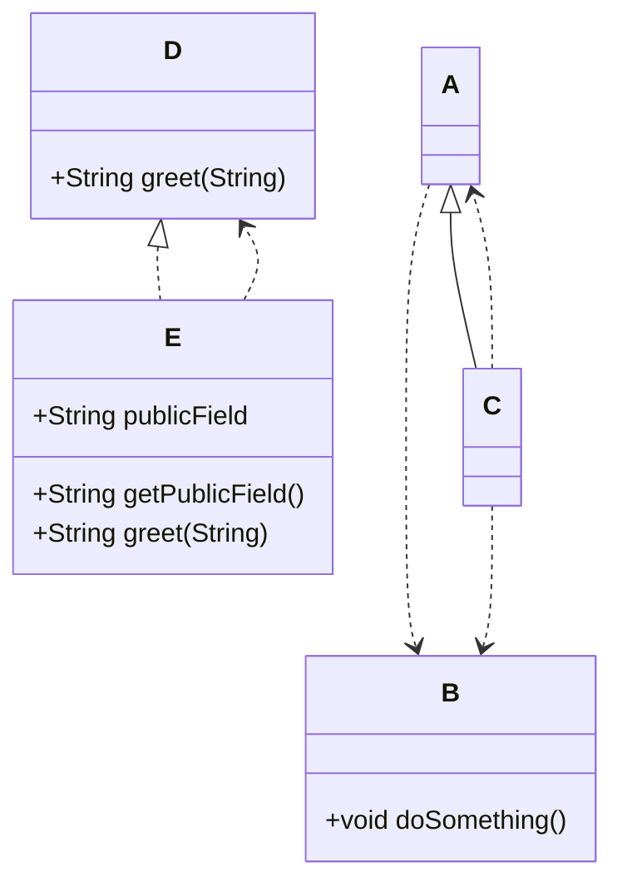

# Code Atlasとは？

Code Atlas Gradle Plugin は、プロジェクトの**コンパイル済みJavaクラス**を走査し、mermaidやplantUMLの形式でクラス図を生成します。
:::message
バージョン番号やオプションは最新バージョンを確認し、設定してください。
(2025/12/13 時点の最新バージョンは1.1.0)
:::

最新のリリース情報は[こちら](https://github.com/euledge/code-atlas/blob/main/docs/RELEASE_NOTES_JA.md)

## なぜ作ったか

- 設計レビューやオンボーディング、ドキュメント作成の場面で、**最新のクラス図が欲しい**が、手作業だとすぐ陳腐化してしまう。
- CIでビルドしているなら、**ビルド成果（.class）から解析**すれば、ソース構文差異やアノテーション処理後の姿に近い図が得られる。
- 出力形式は、**PlantUML**と**Mermaid**をサポートして、ドキュメントやWikiの既存資産を活かしたい。

[Jig](https://github.com/dddjava/jig)や[SpringBoot Modulith](https://spring.pleiades.io/projects/spring-modulith)にもクラス図生成の機能はあり、はじめはこれを使用しようと思っていたのですが、JIGではPlantUMLやmermaidでの出力ができず、SpringBoot Modulithでは別途package-info.javaの記述が必要であったり、クラス図が欲しいというだけのニーズにおいては使いずらいなと思いました。
そこで自分が必要とする最小限のニーズを簡単に実現したいとの思いで今回ツールの作成を思い立ちました。

## Code Atlas 概要

Code Atlas Gradle Plugin は、プロジェクトの**コンパイル済みJavaクラス**を走査し、以下の形式でクラス図を生成します：

- **PlantUML** (`.puml`)
[Plant UML Editor](https://editor.plantuml.com/uml/SoWkIImgAStDuULApaaiBbP8pi_LIwr8p2t8ITKhXb1E2jMyN0f0eArGbf-Pef2I7voVcrgIaPcNhg79orMBHwiZI2j80JOfFJqxhDRXCSy5uPJWaYAW0nJIYr9JIpGW70AESSRd69iQNLsich2gTyRdU1AKE-9nhYk6NmjAat8oazqoKtDIq4CXjIG08GcA5KA1X2riRMhqzB2w1AjwLroUSk7bSaZDIm4dAW00) にて表示確認済
- **Mermaid** (`.mmd`)  
[Mermaid Live Editor](https://mermaid.live/edit#pako:eNqVUlFPwjAQ_ivLPWHEpmV2Yw0xQcBnE97MXupax-LaLl1nUNh_d2ygMRkO7qW9fvfdfXfXHSRGSGCQ5LwslxlPLVex9hprX7zEKCS3XBW5RGV3PHq7LuJgtx8mE54wa6Ok22Q6Hd10YD2QZX7EexAPoYfewgMpl3-ErZ1t5HipldKNOudCaYt_pM32d3fXcRZD7VxBmQ8oX_VNoKhe8yx5ymQuesYj3fMvflrehQPsW8Fsj1CvtLOc1blul7GGMaQ2E8CcreQYlLSKH1xo-4zBbaSSMbDmKrh9jyHWdcMpuH4xRp1o1lTpBtgbz8vGqwrBnTz-9Z8QqYW0C1NpB4y2GYDtYAuM4CkilIYTTKiPI9yAn8AigvyI0CAKcUCxfx_UY_hqS2I0Jdin_iSMCPHDIKL1NxPMFwk) にてMermaid version 11.12.0で表示確認済

### 生成されたmermaid図



生成した図はアーキテクチャ、依存関係、継承、インターフェイス実装の可視化に役立ちます。

内部では **ClassGraph** を用いたクラスパス走査を採用しています。（Java 21 / Gradle 8.5+ を要件）


## 導入方法

`build.gradle.kts` にプラグインを追加します：

```kotlin
plugins {
    id("io.github.euledge.code-atlas") version "1.0.0"
}
```

## オプション設定

オプション設定（出力先や対象パッケージなど）は拡張プロパティで指定できます：

``` kotlin
codeAtlas {
    formats.set(listOf("plantuml", "mermaid")) // 出力形式（複数可）
    outputDir.set("docs/diagrams")             // 出力ディレクトリ
}
```

### オプション一覧

| プロパティ名 | 例 | 説明 |
|---|---|---|
| `formats` | `plantuml,mermaid` | カンマ区切りのフォーマット一覧。 |
| `outputDir` | `reports/diagrams` | 出力ディレクトリパス。 |
| `rootPackages` |  `com.example.domain,com.example.infrastructure` | クラスをフィルタリングするカンマ区切りのパッケージプレフィックス一覧。 |
| `showDetails` | `true` または `false` | `true`の場合、公開フィールドとメソッドを図に含めます。（デフォルト: `false`） |

## 使い方

設定されたオプションに従って以下のコマンドを実行することで図が生成されます。

```bash
./gradlew generateDiagrams
```

## コマンドラインからの上書き
CIや一時的な出力切り替えに便利です。オプションはGradleのプロジェクトプロパティで上書きできます：

```bash
./gradlew generateDiagrams \
  --project-prop formats=plantuml,mermaid \
  --project-prop outputDir=reports/diagrams \
  --project-prop rootPackages=com.example.domain,com.example.infrastructure \
  --project-prop showDetails=true
```

または、`-P` Windowsではダブルクォーテーションを使用する必要がある場合があります:
```sh
./gradlew generateDiagrams \
-P"formats=plantuml,mermaid" \ 
-P"outputDir=reports/diagrams" \ 
-P"rootPackages=com.example.domain,com.example.infrastructure" \ 
-P"showDetails=true"
```

# 開発のポイント

依存関係の解析において最も重要な役割を果たしたのが **ClassGraph** というライブラリの存在です。

[ClassGraph](https://github.com/classgraph/classgraph) は、Java のクラスパスを高速に走査し、クラス情報・依存関係・メタデータを取得できるオープンソースライブラリです。
従来の リフレクション だけでは取得できない インターフェース実装関係、外部クラスの依存、アノテーション情報 などをワンパスで取得できます。

図の生成については、今回はクラス図のみという要件で、mermaidやplantUMLの記法がシンプルで変更が起きにくいものという理由で特にライブラリを用いず単純な文字列生成で行いました。

サンプルの簡単なクラスではわからなかったのですが、業務で使用しているプロジェクトでクラス図を出力したところ、名称に$が付くクラスが出てきてしまい、mermaidやplantUMLの出力に失敗することが起きました。
調べると合成クラス、内部クラス、および匿名内部クラスのようなものであることがわかり、出量の対象から外す処理を加えました。

# ライセンス・リポジトリ

- MIT License

GitHub: [euledge/code-atlas（README英/日・サンプルあり）](https://github.com/euledge/code-atlas)
Gradle Plugin: [https://plugins.gradle.org/plugin/io.github.euledge.code-atlas](https://plugins.gradle.org/plugin/io.github.euledge.code-atlas)

# 参考

- [baeldung - Guide to Classgraph Library](https://www.baeldung.com/classgraph)
- Gradle 公式「Publishing Plugins to the Gradle Plugin Portal」[userguide/publishing_gradle_plugins](https://docs.gradle.org/current/userguide/publishing_gradle_plugins.html)
